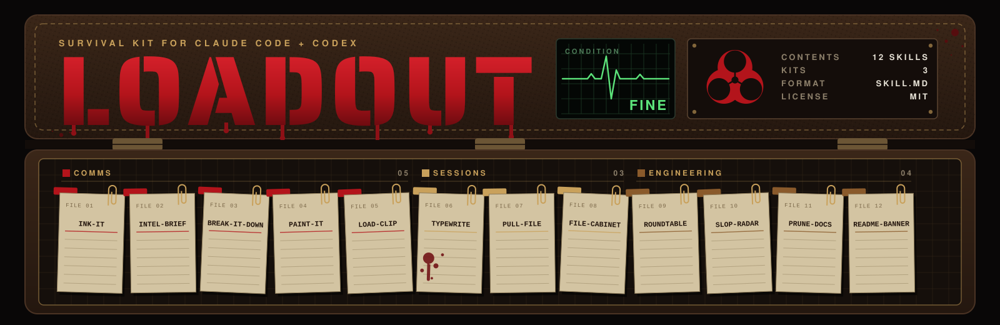

<p align="center">
  
</p>

# loadout

Agent skills I use every day, cleaned up for other people. Small on purpose: each one does one job and was kept because it kept earning its place.

Works in Claude Code and Codex, and in other runtimes that read `SKILL.md`. `load-clip` needs macOS, and in Codex it needs approval to run outside the sandbox.

## Install

```bash
claude plugin marketplace add rm0nroe/loadout
claude plugin install rm0nroe-loadout@rm0nroe
```

Or install them as plain skill files for Claude Code, Codex and other agents with [skills.sh](https://skills.sh), picking the ones you want:

```bash
npx skills@latest add rm0nroe/loadout
```

Plugins from this marketplace don't auto-update by default. Turn it on in `/plugin` (Marketplaces tab, select `rm0nroe`, Enable auto-update), or update by hand with `claude plugin update rm0nroe-loadout@rm0nroe`. Copied skill files are yours to edit, and `npx skills update` pulls new versions. Pick one way: installing both leaves you with every skill twice.

Or copy a single skill folder into `~/.claude/skills/`.

Then, in any Claude Code session:

```
/rm0nroe-loadout:ink-it draft a slack message: the deploy slipped to Friday
```

Installed as a plugin, skills are namespaced (`/rm0nroe-loadout:<skill>`). Copied into `~/.claude/skills/`, they run as `/<skill>`. Most also trigger on plain requests ("draft a PR description", "explain that simply").

## Requirements

- `ink-it`: Python 3.9+ (standard library only). Voice profiles are optional and live in `~/.config/ghostwriter/` (override with `$GHOSTWRITER_HOME`), never in this repo.
- `load-clip`: macOS (`osascript`, `textutil`) and Python 3.
- `exec-recap`: `git`, and the [GitHub CLI](https://cli.github.com/) (`gh`) for release lists and notes.
- `prune-docs`: classifying docs needs nothing extra. Writing `.graphifyignore` and rebuilding or verifying the graph needs [graphify](https://pypi.org/project/graphifyy/) (`uv tool install graphifyy`).
- `readme-banner`: [uv](https://docs.astral.sh/uv/) (runs the outline script and fetches `fonttools` itself) and `rsvg-convert` from librsvg (`brew install librsvg`) for render checks.
- Everything else: nothing beyond Claude Code.

## Communication

- **ink-it**: drafts Slack messages, emails, PR titles and bodies, review comments, commits, release notes, postmortems, tickets, articles and docs in your own voice. Keeps facts, code, identifiers and URLs byte-exact. Drafting only, never sends.
- **intel-brief**: writes a message for someone who was not in the conversation, so you can forward it as a handoff.
- **break-it-down**: rewrites the last reply as a direct explanation. Blunt point, numbered facts, the mix-up named, one rule. No metaphors.
- **paint-it**: the opposite of break-it-down. Rewrites the last reply as one everyday analogy with numbered roles.
- **load-clip**: puts formatted text on the clipboard so bold, bullets and links survive a paste into Slack or Jira. macOS only.
- **exec-recap**: turns a version range, a date range ("last two days") or a commit range into a one-screen, plain-language recap for executives who have never seen the project. Every line traces back to a release note, PR or commit.

## Sessions

Save where you are, clear context, pick up later. State files live in `~/.claude_states/<repo-name>/`, outside every repo.

- **typewrite**: saves session progress to a named state file.
- **pull-file**: loads a saved state file back into a fresh session.
- **file-cabinet**: lists the saved state files for the current project.

## Engineering

- **roundtable**: four parallel agents (product, tech lead, devil's advocate, QA) argue a decision against your actual code, then the positions are tallied into a consensus and an action plan.
- **slop-radar**: audits a screenshot, URL or source tree for generic, AI-template design choices.
- **prune-docs**: finds stale docs so code indexers and knowledge graphs only see live content.
- **readme-banner**: designs a README hero banner as one self-contained SVG, wordmark converted to font outlines so it renders the same on every machine. Made this repo's banner.

## License

MIT. `ink-it` includes third-party material under MIT; see its `THIRD_PARTY_NOTICES.md`.
